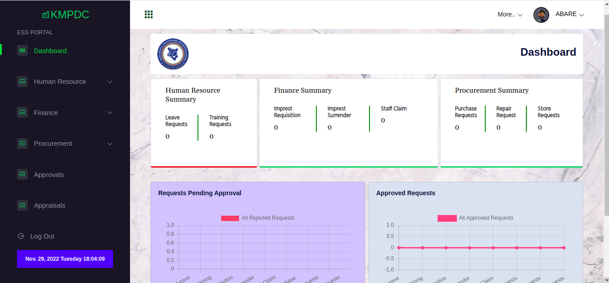

# KMPDC EMPLOYEE SELF SERVICE PORTAL
## Project Description
ESS portal empowers employees to access, manage, and request their HR-related tasks such as requesting PTO, updating their personal information, managing their benefits, and much more.

##### By Enock Abere 

### Live link
Visit the application on http://20.121.189.145:88/
### Setup & Run Instructions
- Create and activate a virtual environment
- Install the dependencies listed in the requirements.txt
- Create a .env file. This will contain environment variables as listed in the .env.sample file.
- Finally, run your app on MODE='dev' config for debugging purposes
### Development
#### Making modifications
To make advancements/modifications, follow these steps:
- Fork the repository
- Create a new branch (git checkout -b improve-feature)
- Make the appropriate changes in the files
- Add changes made
- Commit your changes (git commit -am 'Improve feature')
- Push to the branch (git push origin improve-feature)
- Create a Pull Request
### Technologies Used
Technologies used to develop this application:
- Python v3.9.5
- Django==4.1.2
- Bootstrap5
- HTML
- CSS
- JQuery
### Support and contact details
Should you be unable to access the website, have any recommendations and/or questions, feel free to email me:[emaeba@kobby.co.ke](mailto:emaeba@kobby.co.ke)

